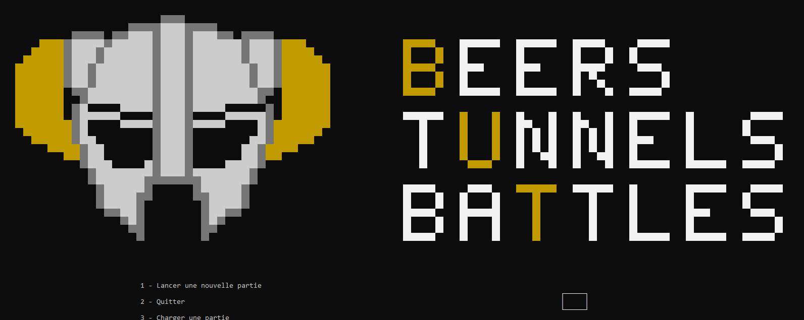
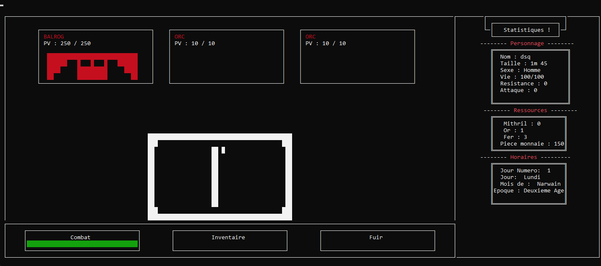

# BeerTunnelsBattles
Premier projet Universitaire de développement lors de ma première année
# Beers Tunnels Battles

Projet universitaire réalisé en **FreePascal** dans le cadre du module **S1.01 & S1.02 – Comparaison d’approches algorithmiques**.

## Présentation

Le projet consiste à reprendre et améliorer un prototype du jeu vidéo **Beers Tunnels Battles** développé pour PC.

L’objectif principal était d’ajouter de nouvelles fonctionnalités au prototype existant tout en appliquant différentes notions d’algorithmique et de structures de données.

---
## Fonctionnalités

- Menu principal
- Création de partie
- Gestion du temps et du calendrier
- Gestion des ressources et équipements
- Système de taverne
- Marchand et stock limité
- Combat dans les mines
- Gestion de l’expérience du personnage
- Sauvegarde et chargement
- Tri et gestion dynamique des recettes

### Algorithmes de tri étudiés
Les trois algorithmes suivants ont été étudiés et comparés :
- Tri par insertion
- Tri fusion
- Quick-sort

## Technologies utilisées

- **FreePascal**
- Programmation procédurale
- Structures de données dynamiques
- Fichiers texte pour les données et sauvegardes

---

## Organisation du projet

Le projet a été réalisé en équipe.

### Gestion des tâches
Un tableau **Trello** a été utilisé afin de :
- répartir les tâches,
- suivre l’avancement,
- organiser les objectifs du cahier des charges.

### Gestion des versions
Le projet ne disposait pas d’un dépôt Git durant le développement.  
Les versions du projet étaient échangées manuellement entre les membres de l’équipe, et les conflits de fusion étaient gérés manuellement lorsque nécessaire.

---

## Lancement du projet

1. Installer FreePascal
2. Ouvrir le projet
3. Compiler puis exécuter le programme

---

## Contenu du rendu

- Code source complet
- Version exécutable du jeu
- Document technique détaillant :
  - les structures de données utilisées,
  - les algorithmes de tri,
  - les choix techniques réalisés.

---

## Auteurs

Projet réalisé dans le cadre du BUT Informatique.
